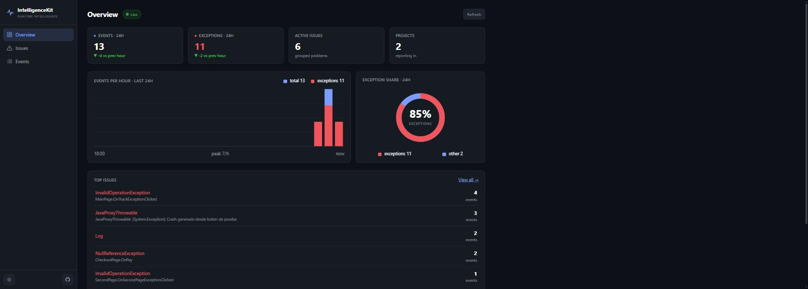
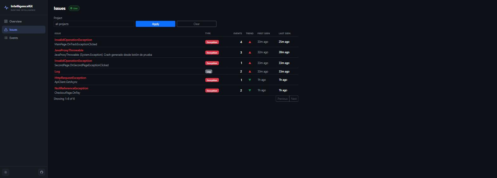
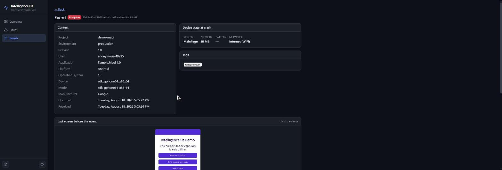
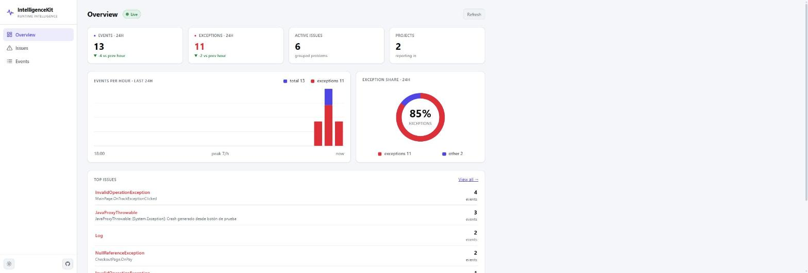
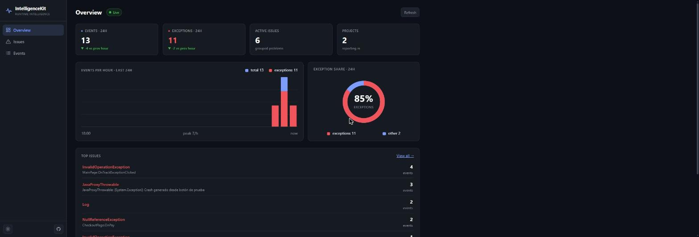
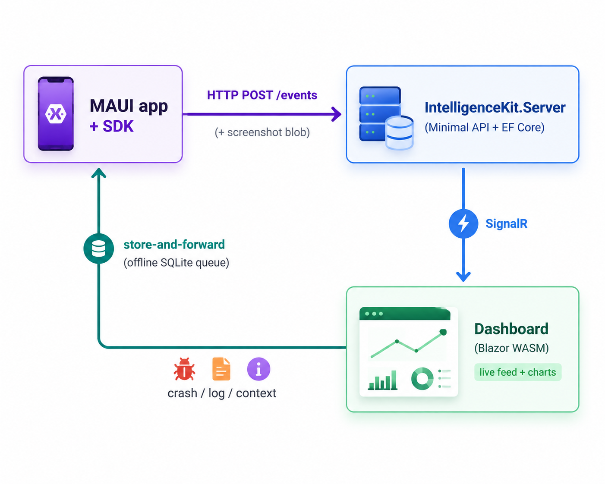

# IntelligenceKit

**Self-hosted observability & crash reporting for .NET and MAUI apps — a Sentry/Crashlytics alternative for the .NET ecosystem.**

[](https://www.nuget.org/packages/IntelligenceKit.Maui/)
[](https://www.nuget.org/packages/IntelligenceKit.Core/)
[](LICENSE)

IntelligenceKit captures crashes, logs and rich runtime context from your app, ships them to a backend you control, and shows them on a real-time dashboard. Add one line to your MAUI app and it starts working — no per-capture-site code.



<p align="center"><em>The real-time Overview — KPI tiles, errors-per-hour, exception share and top issues. Dark theme by default, with a light toggle.</em></p>

> **Status: early / pre-release (alpha).** The first packages are published to NuGet (`0.1.0-alpha`), but the API is still moving and the read API/dashboard are currently unauthenticated (see [Security](#security)). Not production-ready — expect breaking changes before `1.0.0`. Feedback and contributions welcome.

---

## Why

The .NET/MAUI ecosystem lacks a lightweight, self-hostable crash + observability stack. Commercial options (Sentry, App Center, Firebase Crashlytics) are either shutting down for .NET, priced per-seat, or not tailored to MAUI. IntelligenceKit aims to be:

- **MAUI-native** — proper crash capture on Android and iOS, device context, last-screen capture.
- **Self-hosted** — your data, your server, your database.
- **One-line integration** — `builder.UseIntelligenceKit(dsn)` and you're done.
- **Clean & extensible** — the core is framework-agnostic; MAUI is just the first client.

## Features

**Client SDK (MAUI)**
- **Crash reporting** on Android & iOS with a typed, nested `ExceptionInfo` (inner-exception chain preserved).
- **Offline store-and-forward** — events persist to a local SQLite queue first, then upload; nothing is lost if the app crashes or is offline. The queue drains on next launch and when connectivity returns.
- **Rich context** — breadcrumbs ("what led here"), a device runtime snapshot (memory, battery, network, current screen), plus `Environment`, `Release`, `User` (anonymous, opt-in), `Tags` and severity levels.
- **Last-screen capture** (opt-in) — a downscaled JPEG of the screen before the crash, captured proactively and stored apart from the event payload. Privacy-first: off by default, per-page exclusion list, no full-res images.
- **Logs** — `TrackLogAsync(level, message, data)` doubles as a breadcrumb.

**Backend & dashboard**
- **Persistent backend** on EF Core with **SQLite (default), PostgreSQL, or SQL Server** — selectable by config.
- **Issue grouping** — repeated crashes collapse into one issue by fingerprint (exception type + top frame), with occurrence counts, first/last seen and a rising/falling trend.
- **Real-time dashboard** (Blazor WebAssembly) — new events *and* issue updates stream in live over SignalR, no refresh.
- **Errors-per-hour chart** and per-project overview.

## Screenshots

| Issues — grouped & trending | Event detail — the full story |
| :---: | :---: |
| [](docs/images/issues.jpg) | [](docs/images/event-detail.jpg) |
| Repeated crashes collapse into one issue with counts and a rising/falling trend. | Exception tree, device state at crash, breadcrumb trail, tags, and the last screen before it happened. |

<p align="center">
  
  
</p>
<p align="center"><em>Dark by default; a one-click toggle for light.</em></p>

## Architecture



Dependency direction (nothing depends on MAUI except the MAUI SDK):

```
Sample.Maui ─► IntelligenceKit.Maui ─► IntelligenceKit.Core
IntelligenceKit.Server    ─► Core, Server.Contracts, Server.Data, Server.Migrations.*
IntelligenceKit.Dashboard ─► Server.Contracts
```

Every event flows through a single funnel (`IntelligenceKitService.Enrich()` → persist → upload), so app/device/runtime/scope context is attached in one place and no capture site fills it in by hand.

## Repository layout

```
src/        Product code (the library + backend + dashboard)
samples/    Sample.Maui — a demo app that consumes the SDK
tests/      Core.Tests (unit) + Server.Tests (integration, WebApplicationFactory)
```

Everything targets **.NET 10**. The solution is `IntelligenceKit.slnx` (the XML solution format).

## Quick start

### Run the whole stack with Docker (recommended)

The fastest path — PostgreSQL + server + dashboard in a single command:

```bash
cp .env.example .env      # then set IK_READ_TOKEN to a long random value
docker compose up --build
```

Dashboard on **http://localhost:8080**, API on **http://localhost:7099**. The server runs against PostgreSQL and applies its schema automatically. See [docker/README.md](docker/README.md) for configuration (ports, credentials, pointing the dashboard at a remote API).

### Run from source

**Prerequisites:** the [.NET 10 SDK](https://dotnet.microsoft.com/download), plus the MAUI workloads (`dotnet workload install maui`) if you're building the SDK/sample.

The three pieces run independently. Start the **server** first (the dashboard and the app both talk to it).

### 1. The server (ingest + query API)

```bash
dotnet run --project src/IntelligenceKit.Server
```

- Listens on **`http://0.0.0.0:7099`** (the `http` launch profile).
- Uses **SQLite by default** and creates/migrates the schema on first run — zero setup.
- To use PostgreSQL or SQL Server, or to protect the read API with a token, see [Configuration](#configuration) and [Security](#security).

Verify it's up:

```bash
curl http://localhost:7099/projects      # → [] until events arrive
```

### 2. The dashboard (Blazor WebAssembly)

```bash
dotnet run --project src/IntelligenceKit.Dashboard
```

- Open the printed URL (e.g. **`http://localhost:5292`**).
- It reads the API address from `src/IntelligenceKit.Dashboard/wwwroot/appsettings.json`:

  ```json
  { "ApiBaseUrl": "http://localhost:7099" }
  ```

- If the server has a read token configured, the dashboard prompts for it once and remembers it in the browser. With no token set, local (Development) runs are open.

### 3. The SDK in your MAUI app

**Install** — from NuGet ([IntelligenceKit.Maui](https://www.nuget.org/packages/IntelligenceKit.Maui/) pulls in [IntelligenceKit.Core](https://www.nuget.org/packages/IntelligenceKit.Core/) automatically):

```bash
dotnet add package IntelligenceKit.Maui --prerelease
```

> `--prerelease` is required while the packages are in `alpha`.

**Wire it up** — a single line in `MauiProgram.cs`:

```csharp
builder
    .UseMauiApp<App>()
    .UseIntelligenceKit("http://demo-key@your-server:7099/my-project");
```

That one call registers crash capture, the offline queue, the uploader, context/breadcrumb tracking, and (opt-in) screen capture. App name and version are auto-detected. The DSN format is explained in [Configuration](#dsn).

> **Android emulator:** it can't reach your host via `localhost`. Use the special alias **`10.0.2.2`** to point at the server running on your machine:
> `UseIntelligenceKit("http://demo-key@10.0.2.2:7099/my-project")`.

**Use it in code** (`IIntelligenceKit` is injected via DI):

```csharp
kit.SetUser("anon-123");                       // optional, anonymous identifier
kit.SetTag("plan", "premium");                 // arbitrary business context
kit.AddBreadcrumb("Tapped Checkout");          // rides along with the next event
await kit.TrackLogAsync(SeverityLevel.Warning, "Cart total mismatch");
await kit.TrackExceptionAsync(ex);             // manual capture — crashes are automatic
```

### Try the whole thing end-to-end

With the server running, launch the sample app (its DSN already points at `10.0.2.2:7099`), trigger a crash or log from its buttons, and watch it appear **live** in the dashboard:

```bash
dotnet build samples/Sample.Maui -t:Run -f net10.0-android
```

## Configuration

### DSN

Configuration is a single connection string bundling server + project identity:

```
http://{projectKey}@{host}:{port}/{projectId}
```

`projectKey` is a **public** routing identifier that ships inside the client app — it separates projects on a shared self-hosted server. **It is not a secret** and does not authenticate anything (yet — see roadmap).

### Database provider (server)

Set in `src/IntelligenceKit.Server/appsettings.json`:

```jsonc
{
  "Database": { "Provider": "Sqlite" },          // Sqlite | PostgreSql | SqlServer
  "ConnectionStrings": { "Events": "Data Source=intelligencekit.db" }
}
```

`ConnectionStrings:Events` is optional for SQLite (defaults to a local file) and required for PostgreSQL / SQL Server. Migrations are applied automatically on startup.

Because EF migrations are provider-specific, each provider has its own migrations assembly. To add one:

```bash
dotnet ef migrations add <Name> \
  --project src/IntelligenceKit.Server.Migrations.Sqlite \
  --startup-project src/IntelligenceKit.Server
```

A schema change means regenerating the migration in all three provider projects.

## Security

The **read side** — every query endpoint plus the SignalR hub and the dashboard — is gated by a single shared admin token. Set it on the server:

```jsonc
// src/IntelligenceKit.Server/appsettings.json
"Auth": { "ReadToken": "ik_admin_<a-long-random-string>" }
```

Callers present it as `Authorization: Bearer <token>` (the dashboard prompts for it once and stores it in the browser). Behaviour when the token is **not** set: reads are **open in Development** (zero-config local runs) and **locked in Production** (fail-closed), so a misconfigured deployment never serves data unprotected.

**Ingest** (`POST /events`) is intentionally open: the client's project key is a public routing identifier that ships inside the app, not a secret — the same model Sentry uses.

> Still evolving: there are no per-user accounts or per-project scoping yet (one shared token). Put the server behind TLS in production.

## Roadmap

Done: crash reporting (Android/iOS) · offline store-and-forward · background uploader · rich context (breadcrumbs, device snapshot, tags/user/env) · last-screen capture · persistent multi-provider backend · real-time SignalR dashboard · errors-per-hour chart · read-side auth · **issue grouping**.

Next:
- [x] **NuGet packaging** — `IntelligenceKit.Core` + `IntelligenceKit.Maui` published (alpha)
- [x] **CI** — GitHub Actions builds the backend + dashboard and runs the core test suite on every push/PR
- [x] **Test coverage** — Core unit tests and Server integration tests (ingest idempotency, issue grouping, read-side auth, enum-over-the-wire, screenshots)
- [ ] Webhook alerts (Slack/Discord/Teams) — fire on new issue / frequency spike
- [ ] AI-assisted diagnosis over grouped issues (opt-in, provider-agnostic, PII-scrubbed)

## Building from source

```bash
dotnet build IntelligenceKit.slnx
```

Requires the .NET 10 SDK, and the MAUI workloads (`dotnet workload install maui`) to build the MAUI/sample projects.

## License

Licensed under the [MIT License](LICENSE).
