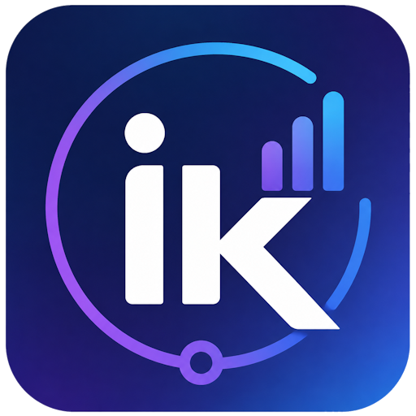

<p align="center">
  
</p>

<h1 align="center">IntelligenceKit</h1>

<p align="center"><strong>Self-hosted observability &amp; crash reporting for .NET and MAUI apps — a Sentry/Crashlytics alternative for the .NET ecosystem.</strong></p>

<p align="center">
  <a href="https://www.nuget.org/packages/IntelligenceKit.Maui/"></a>
  <a href="https://www.nuget.org/packages/IntelligenceKit.Core/"></a>
  <a href="LICENSE"></a>
</p>

IntelligenceKit captures crashes, ANRs, logs, sessions and performance from your app, ships them to a backend you control, and shows them on a real-time dashboard with issue triage, release health and alerts. It works with **MAUI** (Android, iOS, Mac Catalyst, Windows), **ASP.NET Core**, **Blazor WebAssembly**, **WPF**, **WinForms**, **Avalonia** and plain console/worker apps. One line of setup, and no code at each capture site.

📖 **[Documentation](https://wilsonvargas.github.io/IntelligenceKit/)** · 🧪 [Try the demo](#try-the-demo) · 🚀 [Deploy](deploy/README.md)


<p align="center"><em>The real-time Overview — KPI tiles, errors-per-hour, exception share and top issues. Dark theme by default, with a light toggle.</em></p>

> **Status: stable (`1.1.0`).** The public SDK API follows [Semantic Versioning](#versioning-and-api-stability). The read side is authenticated (admin token or per-project read key), and the stack is self-hostable with Docker or one-click cloud templates. See the [CHANGELOG](CHANGELOG.md) for what shipped. Feedback and contributions are welcome.

---

## Why

The .NET/MAUI ecosystem lacks a lightweight, self-hostable crash + observability stack. Commercial options (Sentry, App Center, Firebase Crashlytics) are either shutting down for .NET, priced per-seat, or not tailored to MAUI. IntelligenceKit aims to be:

- **MAUI-native** — proper crash capture on Android and iOS, device context, last-screen capture.
- **Self-hosted** — your data, your server, your database.
- **One-line integration** — `builder.UseIntelligenceKit(dsn)` and you're done.
- **All of .NET** — the core is framework-agnostic, with SDKs for MAUI, ASP.NET Core, Blazor, WPF, WinForms, Avalonia and generic hosts.

## Features

**Capture**
- **Crashes** on Android (managed and Java), iOS, Mac Catalyst, Windows and desktop, written to a local queue and sent on the next launch. Handled exceptions and `ILogger` errors are captured too.
- **ANR detection**: a frozen UI thread is reported as `ApplicationNotResponding`.
- **Sessions**: crash-free sessions and crash-free users, per release.
- **Performance**: app start, page load, HTTP client and ASP.NET Core request timings (p50, p75, p95).
- **Context**: breadcrumbs, device state at the time of the crash, environment, release, user, tags, opt-in last-screen capture, and user feedback (including a "what were you doing?" prompt after a crash).
- **Offline store-and-forward**: nothing is lost when the app crashes or is offline.
- **Privacy**: PII scrubbing on by default, `BeforeSend` / `BeforeBreadcrumb` hooks, and sampling.

**Triage**
- **Issues** grouped by exception type and top in-app frame (or a custom fingerprint), with resolve / ignore / assign and **regression detection** ("resolved in 2.4.1" and seen again).
- **Release health**: adoption, crash-free rates and new issues per release.
- **Readable release stack traces**: upload PDBs and R8 mappings (an MSBuild target does it after a Release build) to get file and line numbers and deobfuscated Java frames.
- **Issue insights**: distributions by platform, OS, device, release and tags; affected users; per-user timelines.
- **Search and filters**, CSV/JSON export, and one-click **GitHub / Jira** issues.
- **Alerts** for new issues, regressions and spikes, via webhook (HMAC-signed), Slack, Teams, Discord or email.

**Run it**
- **Your database**: SQLite (default), PostgreSQL or SQL Server.
- **Real-time dashboard** (Blazor WebAssembly) over SignalR, with a project management page, dark and light themes.
- **Deploy anywhere**: Docker images on GHCR, Docker Compose, and templates for Render, Azure App Service and Railway.
- **Operable**: `/health/live` and `/health/ready`, Prometheus `/metrics`, OTLP export, retention, rate limiting and a read-only demo mode.

## Screenshots

| Issues — grouped & trending | Event detail — the full story |
| :---: | :---: |
| [](docs/images/issues.jpg) | [](docs/images/event-detail.jpg) |
| Repeated crashes collapse into one issue with counts and a rising/falling trend. | Exception tree, device state at crash, breadcrumb trail, tags, and the last screen before it happened. |

<p align="center">
  
  
</p>
<p align="center"><em>Dark by default; a one-click toggle for light.</em></p>

## Architecture


Dependency direction (nothing depends on MAUI except the MAUI SDK):

```
Sample.Maui ─► IntelligenceKit.Maui ─────────────┐
IntelligenceKit.AspNetCore / Blazor / Wpf /      ├─► Extensions.Logging ─► IntelligenceKit.Core
  WinForms / Avalonia ─► IntelligenceKit.Hosting ┘
IntelligenceKit.Server    ─► Core, Server.Contracts, Server.Data, Server.Migrations.*
IntelligenceKit.Dashboard ─► Server.Contracts
```

Every event flows through a single funnel (`IntelligenceKitService.Enrich()` → persist → upload), so app/device/runtime/scope context is attached in one place and no capture site fills it in by hand.

## Repository layout

```
src/        Product code: the SDK packages, the backend and the dashboard
samples/    Sample.Maui, a demo app that uses the SDK
tests/      Core.Tests (unit), Sdk.Tests (hosting/ASP.NET Core SDKs) and
            Server.Tests (integration, WebApplicationFactory)
docs/       The documentation site (GitHub Pages)
deploy/     Render, Azure and Railway templates
```

Everything targets **.NET 10**. The solution is `IntelligenceKit.slnx` (the XML solution format).

## Quick start

### Try the demo

Two weeks of sample data (releases, a regression, ANRs, slow endpoints, user feedback) in a read-only instance:

```bash
IK_READ_TOKEN=demo docker compose -f docker-compose.yml -f docker-compose.demo.yml up -d
```

Open **http://localhost:8080** and sign in with `demo`.

### Run the whole stack with Docker (recommended)

The fastest path — PostgreSQL + server + dashboard in a single command:

```bash
cp .env.example .env      # then set IK_READ_TOKEN to a long random value
docker compose up -d       # prebuilt images from GHCR; add --build to build from source
```

Dashboard on **http://localhost:8080**, API on **http://localhost:7099**. The server runs against PostgreSQL and applies its schema automatically. See [docker/README.md](docker/README.md) for configuration (ports, credentials, pointing the dashboard at a remote API).

### Run from source

**Prerequisites:** the [.NET 10 SDK](https://dotnet.microsoft.com/download), plus the MAUI workloads (`dotnet workload install maui`) if you're building the SDK/sample.

The three pieces run independently. Start the **server** first (the dashboard and the app both talk to it).

### 1. The server (ingest + query API)

```bash
dotnet run --project src/IntelligenceKit.Server
```

- Listens on **`http://0.0.0.0:7099`** (the `http` launch profile).
- Uses **SQLite by default** and creates/migrates the schema on first run — zero setup.
- To use PostgreSQL or SQL Server, or to protect the read API with a token, see [Configuration](#configuration) and [Security](#security).

Verify it's up:

```bash
curl http://localhost:7099/projects      # → [] until events arrive
```

### 2. The dashboard (Blazor WebAssembly)

```bash
dotnet run --project src/IntelligenceKit.Dashboard
```

- Open the printed URL (e.g. **`http://localhost:5292`**).
- It reads the API address from `src/IntelligenceKit.Dashboard/wwwroot/appsettings.json`:

  ```json
  { "ApiBaseUrl": "http://localhost:7099" }
  ```

- If the server has a read token configured, the dashboard prompts for it once and remembers it in the browser. With no token set, local (Development) runs are open.

### 3. The SDK in your MAUI app

**Install** — from NuGet ([IntelligenceKit.Maui](https://www.nuget.org/packages/IntelligenceKit.Maui/) pulls in [IntelligenceKit.Core](https://www.nuget.org/packages/IntelligenceKit.Core/) automatically):

```bash
dotnet add package IntelligenceKit.Maui
```

**Wire it up** — a single line in `MauiProgram.cs`:

```csharp
builder
    .UseMauiApp<App>()
    .UseIntelligenceKit("http://demo-key@your-server:7099/my-project");
```

That one call registers crash capture, the offline queue, the uploader, context/breadcrumb tracking, and (opt-in) screen capture. App name and version are auto-detected. The DSN format is explained in [Configuration](#dsn).

> **Android emulator:** it can't reach your host via `localhost`. Use the special alias **`10.0.2.2`** to point at the server running on your machine:
> `UseIntelligenceKit("http://demo-key@10.0.2.2:7099/my-project")`.

**Other app types** use the same DSN:

```csharp
builder.UseIntelligenceKit(dsn);                     // ASP.NET Core, or Blazor WebAssembly
IntelligenceKitWpf.Init(dsn);                        // WPF (App constructor)
IntelligenceKitWinForms.Init(dsn);                   // WinForms (Main)
AppBuilder.Configure<App>().UseIntelligenceKit(dsn); // Avalonia
services.AddIntelligenceKit(dsn);                    // console apps, workers, services
```

See [SDKs](https://wilsonvargas.github.io/IntelligenceKit/sdks) for the details of each one.

**Use it in code** (`IIntelligenceKit` is injected via DI):

```csharp
kit.SetUser("anon-123");                       // optional, anonymous identifier
kit.SetTag("plan", "premium");                 // arbitrary business context
kit.AddBreadcrumb("Tapped Checkout");          // rides along with the next event
await kit.TrackLogAsync(SeverityLevel.Warning, "Cart total mismatch");
await kit.TrackExceptionAsync(ex);             // manual capture — crashes are automatic
```

### Try the whole thing end-to-end

With the server running, launch the sample app (its DSN already points at `10.0.2.2:7099`), trigger a crash or log from its buttons, and watch it appear **live** in the dashboard:

```bash
dotnet build samples/Sample.Maui -t:Run -f net10.0-android
```

## Configuration

### DSN

Configuration is a single connection string bundling server + project identity:

```
http://{projectKey}@{host}:{port}/{projectId}
```

`projectKey` is a **public** routing identifier that ships inside the client app — it separates projects on a shared self-hosted server. **It is not a secret** and does not authenticate anything (yet — see roadmap).

### Database provider (server)

Set in `src/IntelligenceKit.Server/appsettings.json`:

```jsonc
{
  "Database": { "Provider": "Sqlite" },          // Sqlite | PostgreSql | SqlServer
  "ConnectionStrings": { "Events": "Data Source=intelligencekit.db" }
}
```

`ConnectionStrings:Events` is optional for SQLite (defaults to a local file) and required for PostgreSQL / SQL Server. Migrations are applied automatically on startup.

Because EF migrations are provider-specific, each provider has its own migrations assembly. To add one:

```bash
dotnet ef migrations add <Name> \
  --project src/IntelligenceKit.Server.Migrations.Sqlite \
  --startup-project src/IntelligenceKit.Server.Migrations.Sqlite
```

A schema change means regenerating the migration in all three provider projects.

### Data retention (server)

A background sweep can prune old data so a self-hosted database doesn't grow
without bound. It's **off by default** — opt in:

```jsonc
"Retention": {
  "Enabled": true,      // off by default; a fresh install never deletes data
  "Days": 90,           // delete events/screenshots older than this (by ReceivedAt),
                        // and issues with no activity since (by LastSeen). Must be > 0.
  "SweepHours": 6       // how often the sweep runs
}
```

The sweep runs at startup and every `SweepHours` thereafter; each pass is a
single set-based delete per table (works on all three providers). With
`Enabled: false` (or `Days <= 0`) it does nothing.

## Security

The **read side** — every query endpoint plus the SignalR hub and the dashboard — is gated by a single shared admin token. Set it on the server:

```jsonc
// src/IntelligenceKit.Server/appsettings.json
"Auth": { "ReadToken": "ik_admin_<a-long-random-string>" }
```

The admin token sees **every** project. Present it as `Authorization: Bearer <token>` (the dashboard prompts for it once and stores it in the browser). Behaviour when the token is **not** set: reads are **open in Development** (zero-config local runs) and **locked in Production** (fail-closed), so a misconfigured deployment never serves data unprotected.

### Per-project scoping (multi-tenant)

Beyond the global admin token, each project can have its **own read key** that sees **only that project's** data — so you can host one server for several teams without each seeing the others' crashes. Manage projects through the admin-only API (gated by the admin token):

```bash
# create a project → returns its read key ONCE (only a hash is stored) + a public ingest key
curl -X POST http://localhost:7099/admin/projects \
  -H "Authorization: Bearer $ADMIN_TOKEN" -H "Content-Type: application/json" \
  -d '{ "projectId": "team-a", "name": "Team A" }'
# GET /admin/projects · POST /admin/projects/{id}/rotate-key · DELETE /admin/projects/{id}
```

A project read key is presented the same way (`Authorization: Bearer <read-key>`); every read endpoint and the SignalR hub then filter to that project, and a `?projectId=` for anyone else's project is ignored (cross-project access returns `404`). A production server can run **project-scoped only** — no global admin token required (though you'll need one to manage projects).

### Ingest

**Ingest** (`POST /events`) is unauthenticated by design: the client's project key is a public routing identifier that ships inside the app, not a secret — the same model Sentry uses. Two guards apply:

- **Known-project validation** — by default the server only accepts events whose `(projectId, projectKey)` pair matches a registered project (unknown → `404`). Turn it off with `Ingest:RequireKnownProject: false` to keep ingest fully open.
- **Rate limiting** — per client IP (fixed window, `300` requests / `60s` by default). A throttled caller gets `429` + `Retry-After`, and the SDK's store-and-forward retries those events later, so none are lost. Tune under `RateLimit:Ingest` (raise `PermitLimit` for clients behind shared NAT); behind a reverse proxy, forward the real client IP so the limit partitions correctly.

> Put the server behind TLS in production. There are no per-user accounts yet — access is by admin token or per-project read key.

## Roadmap

Shipped in `1.1.0`: issue lifecycle and regressions · alerts · sessions and crash-free rates · release health · ANR detection · symbolication · `BeforeSend`, sampling and PII scrubbing · performance monitoring · better grouping and backfill · `ILogger` provider · ASP.NET Core, Blazor, WPF, WinForms, Avalonia and generic-host SDKs · MAUI on Windows and Mac Catalyst · user feedback · search and filters · issue distributions · affected users · project management UI · export and GitHub/Jira issues · health checks and metrics · GHCR images and cloud templates · demo mode and documentation site.

Next:
- [ ] Native iOS `NSException` and signal handlers (capture is managed-exception only today)
- [ ] Per-user accounts and roles for the dashboard
- [ ] AI-assisted diagnosis over grouped issues (opt-in, provider-agnostic, PII-scrubbed)

## Versioning and API stability

IntelligenceKit follows [Semantic Versioning](https://semver.org/). As of `1.0.0`
the **public API of the IntelligenceKit SDK NuGet packages** (`Core`, `Maui`,
`Hosting`, `Extensions.Logging`, `AspNetCore`, `Blazor`, `Wpf`, `WinForms`, `Avalonia`)
is stable: no breaking changes without a major (`2.0.0`) bump. That
covers `UseIntelligenceKit` and the other entry points, `IIntelligenceKit`,
`IntelligenceOptions`, the domain model and the public abstractions.

Not covered by the SemVer guarantee (may change in a minor release): the server's
HTTP endpoints and database schema, the dashboard, and the DSN/wire format — though
these are treated with care and documented in the [CHANGELOG](CHANGELOG.md).

## Building from source

```bash
dotnet build IntelligenceKit.slnx
```

Requires the .NET 10 SDK, and the MAUI workloads (`dotnet workload install maui`) to build the MAUI/sample projects.

## License

Licensed under the [MIT License](LICENSE).
